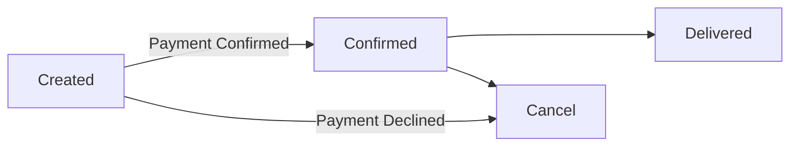

# Orders Application

2 applications written with **NodeJS**. Each of the application have own purpose of existing and responsibility.

**1. Order Application**
Order App consists of front-end and back-end together with **Next.js** React Framework.

Order App have 4 available states retrieve from the backend:
1. Created
2. Confirmed
3. Delivered
4. Canceled
> **Note**: After 3 seconds `confirmed` orders will automatically moved to the `delivered` state.

Order App API routes can be accessed on [http://localhost:3000/api/*](http://localhost:3000/api/*), below are the available endpoints:
1. Create an order `/api/create-order`
2. Cancel an order `/api/cancel-order`
3. Check order status `/api/check-order`
4. Retrieve menu items `/api/menu`

**2. Payment Application**
Payment App handle request by Order App to verify payment transaction, return either 1 of the states below for order:
1. Confirmed
2. Declined 

## Flow Chart of Order State


## Getting Started
### Steps:
1. Git clone project [https://github.com/chrisstang/orders-app.git](https://github.com/chrisstang/orders-app.git)
2. Move to the folder directory
3. Run `npm install` or `yarn` to install packages

#### Run the development server: 
```bash
npm run dev
# or
yarn dev
```

Open [http://localhost:3000](http://localhost:3000) with your browser to see the **Order App**.

#### Run the payment server:
```bash
npm run payment:dev
# or
yarn payment:dev
```
**Payment App** running on [http://localhost:5000](http://localhost:5000) .

## Unit Test
Test case written for rendered output of front-end only (Home page).

Run the test:
```bash
npm test
# or
yarn test
```

## Deployment
The easiest way to deploy Next.js app is to use the  [Vercel Platform](https://vercel.com/new?utm_medium=default-template&filter=next.js&utm_source=create-next-app&utm_campaign=create-next-app-readme)  from the creators of Next.js.

Alternative using Terraform, Next.js with AWS. [https://github.com/milliHQ/terraform-aws-next-js](https://github.com/milliHQ/terraform-aws-next-js)

Create resources in AWS:
```bash
terraform init    # Only needed on the first time running Terraform
terraform plan    # (Optional) See what resources Terraform will create
terraform apply   # Create the resources in your AWS account
```

Deploy using `tf-next`:
```bash
npm i -g tf-next@canary

tf-next build

tf-next deploy --endpoint https://<api-id>.execute-api.us-west-2.amazonaws.com
```